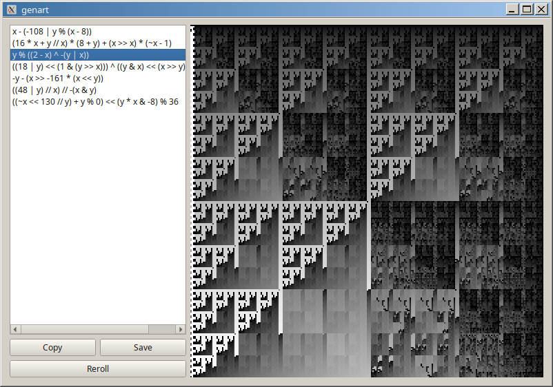

# Generative pixel art with Qt and numpy

This Python app randomly generates mathematical expressions ("programs") that
compute a pixel intensity for each point in the x, y plane. Several interesting
programs are pre-populated. You can generate new programs with the "Reroll"
button. The "Save" button exports a PNG and the "Copy" button copies the program
to the clipboard.
